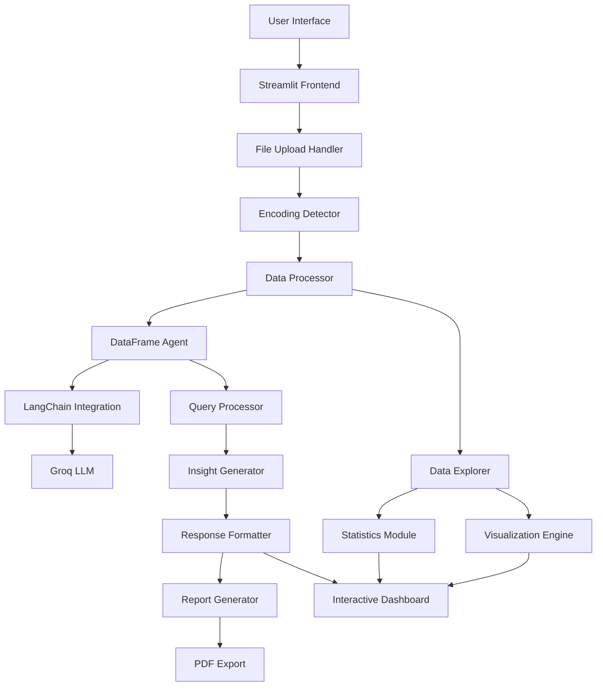

## 📋 Table of Contents
- [✨ Features](#features)
- [🚀 Quick Start](#quick-start)
- [🛠️ Installation](#installation)
- [⚙️ Configuration](#configuration)
- [📊 Usage Guide](#usage-guide)
- [🏗️ Architecture](#architecture)
- [🔧 API Reference](#api-reference)
- [📈 Visualization](#visualization)
- [📄 Reporting](#reporting)
- [🔒 Security](#security)
- [🤝 Contributing](#contributing)
- [📄 License](#license)
- [👨‍💻 Developer](#developer)

## ✨ Features

### 🎯 Core Features
- **🤖 AI-Powered Data Analysis** - Natural language queries for data insights
- **📁 Smart File Processing** - Automatic encoding detection for CSV files
- **📊 Automated Visualization** - AI-driven chart generation based on queries
- **💬 Conversational Interface** - Interactive Q&A with your dataset
- **📈 Real-time Analytics** - Instant insights with statistical summaries

### 🛡️ Professional Features
- **⚡ Multi-Format Support** - Handle various CSV encodings seamlessly
- **🎨 Professional UI/UX** - Modern gradient-based design with custom CSS
- **📄 PDF Report Generation** - Export comprehensive analysis reports
- **📱 Responsive Dashboard** - Interactive tabs for data exploration
- **🔧 Advanced Configuration** - Customizable AI parameters

### 🚀 Technical Highlights
- LangChain + Pandas Agent integration
- Real-time data processing and analysis
- Automated encoding detection with fallback
- Plotly interactive visualizations
- Session state management for multi-user support

## 🚀 Quick Start

### Prerequisites
- Python 3.9+
- Groq API Key (get from [Groq Console](https://console.groq.com))
- Streamlit account (for deployment)

### One-Line Installation
```bash
pip install streamlit langchain-groq pandas plotly fpdf chardet && streamlit run app.py
```

## 🛠️ Installation

### Method 1: Standard Installation
```bash
# Clone the repository
git clone https://github.com/muhammadawaislaal/bi-conversational-ai.git
cd bi-conversational-ai

# Create virtual environment
python -m venv venv

# Activate virtual environment
# Windows:
venv\Scripts\activate
# Mac/Linux:
source venv/bin/activate

# Install dependencies
pip install streamlit langchain-groq pandas plotly fpdf chardet tabulate

# Run the application
streamlit run app.py
```

### Method 2: Docker Installation
```dockerfile
# Dockerfile
FROM python:3.9-slim
WORKDIR /app
COPY requirements.txt .
RUN pip install --no-cache-dir -r requirements.txt
COPY . .
EXPOSE 8501
CMD ["streamlit", "run", "app.py", "--server.port=8501", "--server.address=0.0.0.0"]
```

```bash
# Build and run
docker build -t bi-ai .
docker run -p 8501:8501 bi-ai
```

## ⚙️ Configuration

### Environment Setup
Create `.streamlit/secrets.toml` for API keys:
```toml
# .streamlit/secrets.toml
GROQ_API_KEY = "your_groq_api_key_here"
API_KEY = "your_backup_api_key"  # Optional
```

### AI Model Configuration
```python
# Default model settings
llm = ChatGroq(
    groq_api_key=API_KEY,
    model_name="llama-3.1-8b-instant",
    temperature=0  # Set to 0 for deterministic analysis
)
```

### Supported Encodings
The application automatically detects and handles:
- UTF-8
- Latin-1
- ISO-8859-1
- CP1252
- UTF-16

## 📊 Usage Guide

### 1. Data Upload
1. **Upload CSV File** - Drag and drop your dataset
2. **Automatic Processing** - Encoding detection and validation
3. **Data Preview** - View sample data and structure

### 2. Data Exploration
- **Data Preview Tab** - View first 10 rows
- **Data Structure Tab** - Column details and data types
- **Statistics Tab** - Numerical summaries
- **Quick Insights Tab** - Automated visualizations

### 3. AI Analysis
#### Ask Questions Naturally:
```
"What are the key trends in sales data?"
"Show me correlations between variables"
"Identify outliers in the dataset"
"Generate sales performance report"
```

#### Example Queries:
- **Trend Analysis**: "What are the monthly sales trends?"
- **Comparative Analysis**: "Compare performance across regions"
- **Statistical Insights**: "What is the average revenue per customer?"
- **Data Quality**: "Are there any missing values in the dataset?"

### 4. Automated Visualizations
The AI automatically generates charts based on query context:
- **Trend Analysis**: Line charts for time series data
- **Distribution**: Histograms and box plots
- **Correlation**: Scatter plots and heatmaps
- **Comparison**: Bar charts and grouped visualizations

### 5. Report Generation
1. Click **"Generate Professional Report"**
2. PDF report includes:
   - Analysis question
   - AI insights
   - Dataset metadata
   - Generation timestamp
3. Download for sharing or presentation

## 🏗️ Architecture

### System Architecture


### Data Flow
1. **File Upload** → Encoding detection → DataFrame creation
2. **User Query** → LangChain agent → Groq API processing
3. **Response Generation** → Text insights + Automated visualizations
4. **Report Creation** → PDF generation with timestamp

## 🔧 API Reference

### Core Functions

#### File Processing
```python
def detect_encoding(raw_data):
    """Detects file encoding using chardet with fallback"""
    # Returns: detected encoding, confidence score
    
def read_csv_with_encoding(file, encodings_to_try):
    """Attempts multiple encodings to read CSV"""
    # Returns: DataFrame, successful encoding
```

#### AI Analysis
```python
def initialize_ai_agent(df, api_key):
    """Creates LangChain pandas dataframe agent"""
    # Returns: LangChain agent instance
    
def process_query(agent, query):
    """Processes natural language query through AI"""
    # Returns: Analysis results
```

#### Visualization
```python
def generate_auto_visualization(df, query):
    """Automatically generates charts based on query keywords"""
    # Returns: Plotly figure object
```

### Session State Management
```python
session_state = {
    "queries_count": 0,           # Track number of queries
    "files_processed": 0,         # Track uploaded files
    "current_dataframe": None,    # Active dataset
    "analysis_history": []        # Previous analyses
}
```

## 📈 Visualization

### Automated Chart Types
1. **Line Charts**: For trend analysis over time
   ```python
   px.line(df, x='date', y='sales', title='Sales Trend')
   ```

2. **Bar Charts**: For categorical comparisons
   ```python
   px.bar(df, x='category', y='revenue', color='region')
   ```

3. **Scatter Plots**: For correlation analysis
   ```python
   px.scatter(df, x='marketing_spend', y='sales')
   ```

4. **Heatmaps**: For correlation matrices
   ```python
   px.imshow(correlation_matrix, color_continuous_scale='RdBu_r')
   ```

5. **Histograms**: For distribution analysis
   ```python
   px.histogram(df, x='customer_age', nbins=20)
   ```

### Custom Styling
```css
/* Gradient backgrounds */
.metric-card {
    background: linear-gradient(135deg, #667eea 0%, #764ba2 100%);
}

/* Interactive elements */
.stButton>button:hover {
    transform: translateY(-2px);
    box-shadow: 0 8px 25px rgba(102, 126, 234, 0.4);
}
```

## 📄 Reporting

### PDF Report Structure
1. **Header**: Professional title and generation timestamp
2. **Metadata**: Dataset information and dimensions
3. **Question**: User's analysis query
4. **Analysis**: AI-generated insights
5. **Visualizations**: Generated charts (if applicable)
6. **Recommendations**: Actionable business insights

### Report Features
- **Professional Formatting**: Arial fonts with proper spacing
- **Timestamps**: Automatic date and time recording
- **Export Options**: Direct download or save to disk
- **Branding**: Custom header with application name

## 🔒 Security

### Data Protection
- **Local Processing**: Data processed in-memory, not stored
- **No File Persistence**: Uploaded files not saved to disk
- **Secure API Calls**: Encrypted communication with Groq API
- **Session Isolation**: Each user session independent

### Privacy Features
- **No Data Collection**: No user analytics or tracking
- **Transparent Processing**: Clear error messages and logs
- **Optional Cloud Deployment**: Can be run locally for maximum privacy
- **GDPR Compliant Design**: Minimal data retention

## 🚀 Deployment

### Streamlit Cloud Deployment
```bash
# 1. Push to GitHub
git add .
git commit -m "Deploy to Streamlit Cloud"
git push origin main

# 2. Deploy via Streamlit Cloud
# - Connect GitHub repository
# - Set GROQ_API_KEY in secrets
# - Deploy from main branch
```

### Self-Hosted Deployment
```bash
# Install system dependencies
sudo apt-get update
sudo apt-get install python3-pip nginx

# Configure Nginx reverse proxy
sudo nano /etc/nginx/sites-available/bi-ai

# Nginx configuration:
server {
    listen 80;
    server_name your-domain.com;
    
    location / {
        proxy_pass http://localhost:8501;
        proxy_set_header Host $host;
        proxy_set_header X-Real-IP $remote_addr;
    }
}
```

### Docker Compose (Multi-container)
```yaml
# docker-compose.yml
version: '3.8'
services:
  bi-ai:
    build: .
    ports:
      - "8501:8501"
    environment:
      - GROQ_API_KEY=${GROQ_API_KEY}
    volumes:
      - ./data:/app/data
```

## 🤝 Contributing

### Development Setup
```bash
# Fork and clone
git clone https://github.com/your-username/bi-conversational-ai.git
cd bi-conversational-ai

# Create development environment
python -m venv venv
source venv/bin/activate  # or venv\Scripts\activate on Windows

# Install development dependencies
pip install -r requirements-dev.txt

# Run with hot reload
streamlit run app.py --server.runOnSave true
```

### Contribution Areas
- 🐛 Bug fixes and error handling improvements
- 📊 New visualization types
- 🤖 Additional AI model integrations
- 🌐 Multi-language support
- 📱 Mobile-responsive enhancements
- 📚 Documentation improvements

### Code Standards
- Follow PEP 8 guidelines
- Add type hints for functions
- Include docstrings for modules and functions
- Write unit tests for new features
- Update requirements.txt when adding dependencies

## 📄 License

MIT License

Copyright (c) 2025 BI Conversational AI Platform

Permission is hereby granted, free of charge, to any person obtaining a copy
of this software and associated documentation files (the "Software"), to deal
in the Software without restriction, including without limitation the rights
to use, copy, modify, merge, publish, distribute, sublicense, and/or sell
copies of the Software, and to permit persons to whom the Software is
furnished to do so, subject to the following conditions:

The above copyright notice and this permission notice shall be included in all
copies or substantial portions of the Software.

THE SOFTWARE IS PROVIDED "AS IS", WITHOUT WARRANTY OF ANY KIND, EXPRESS OR
IMPLIED, INCLUDING BUT NOT LIMITED TO THE WARRANTIES OF MERCHANTABILITY,
FITNESS FOR A PARTICULAR PURPOSE AND NONINFRINGEMENT. IN NO EVENT SHALL THE
AUTHORS OR COPYRIGHT HOLDERS BE LIABLE FOR ANY CLAIM, DAMAGES OR OTHER
LIABILITY, WHETHER IN AN ACTION OF CONTRACT, TORT OR OTHERWISE, ARISING FROM,
OUT OF OR IN CONNECTION WITH THE SOFTWARE OR THE USE OR OTHER DEALINGS IN THE
SOFTWARE.

## 👨‍💻 Developer

### Project Maintainer
**Muhammad Awais Laal**
- 👨‍💻 Full Stack AI Developer
- 📧 Email: m.awaislaal@gmail.com
- 🔗 GitHub: [@muhammadawaislaal](https://github.com/muhammadawaislaal)
- 💼 LinkedIn: [Muhammad Awais Laal](https://linkedin.com/in/muhammadawaislaal)

### Technical Stack
- **Frontend**: Streamlit, Custom CSS, Plotly
- **Backend**: Python, LangChain, Pandas
- **AI/ML**: Groq API, LLaMA 3.1, Data Analysis Agents
- **Visualization**: Plotly, Matplotlib
- **Reporting**: FPDF for professional PDF generation
- **Deployment**: Streamlit Cloud, Docker, Nginx

### Special Thanks
- [Streamlit](https://streamlit.io) for the amazing framework
- [Groq](https://groq.com) for high-performance AI inference
- [LangChain](https://langchain.com) for AI agent framework
- [Plotly](https://plotly.com) for interactive visualizations

<div align="center">

---

### ⭐ Support the Project

If you find this project useful, please give it a star on GitHub!

**Built with ❤️ for the Data Science Community**

*"Transforming raw data into business intelligence"*

</div>

